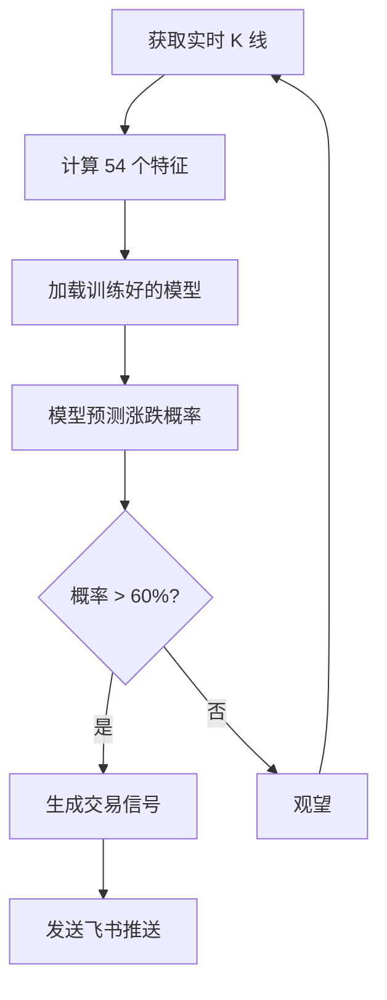

> 💡 **本教程适合谁**：想理解机器学习如何应用于加密货币交易，想知道代码背后的原理，想自己修改和优化模型。

---

## 📖 目录

本教程共 10 个部分：

1. 项目概述
2. 机器学习交易原理
3. 特征工程详解（54 个特征）
4. 标签设计
5. 模型训练详解
6. 验证方法
7. 特征重要性分析
8. 实战使用
9. 常见问题
10. 代码详解

---

## 第一部分：项目概述

### 什么是机器学习交易？

**传统交易策略**是人定规则：
```
如果 RSI < 30 → 买入
如果 突破前高 → 买入
如果 均线金叉 → 买入
```

**机器学习交易**是数据定规则：
```
给模型看 10000 个历史例子
让它自己找"什么情况下会涨"
模型学会后，看到新情况 → 预测涨跌
```

### 为什么用 XGBoost？

| 特性 | XGBoost | 深度学习 | 传统策略 |
|------|---------|----------|----------|
| 训练速度 | 快（分钟级） | 慢（小时级） | 无需训练 |
| 数据需求 | 中等 | 大量 | 无需数据 |
| 可解释性 | 高 | 低 | 高 |
| 准确率 | 中等 | 中等 | 低 |
| 实盘部署 | 简单 | 复杂 | 简单 |

**结论**：XGBoost 是**性价比最高**的选择。

### 项目结构

```
ml_trading/
├── ml/
│   ├── features.py      # 特征工程（54 个特征）
│   ├── train.py         # 模型训练
│   ├── validate.py      # 交叉验证
│   └── models/          # 保存的模型
│       └── BTCUSDT_model.pkl
├── README.md
└── ML_TRADING_TUTORIAL.md  # 本教程
```

---

## 第二部分：机器学习交易原理

### 监督学习在交易中的应用

**核心思想**：用历史预测未来

```
历史数据 → 特征 → 标签 → 训练 → 模型 → 预测新数据
```

**具体流程**：

<grid cols="2">
<column>

**输入（特征）**
- 过去 24 小时价格
- 成交量变化
- 技术指标值
- ...

</column>
<column>

**输出（标签）**
- 未来 4 小时涨 = 1
- 未来 4 小时跌 = 0

</column>
</grid>

### 完整交易流程



### 期望值计算：为什么 52% 准确率也能赚钱？

**关键不是准确率，是期望值**

```
假设：
- 准确率：52%
- 盈亏比：1.5:1（赚 1.5%，亏 1%）
- 每次交易仓位：10%

期望值 = 0.52 × 1.5% - 0.48 × 1%
       = 0.78% - 0.48%
       = 0.30%（正期望）

100 次交易预期收益：100 × 0.30% × 10% = 3%
```

**结论**：只要期望值为正，配合风控就能赚钱。

---

## 第三部分：特征工程详解（54 个特征）

> ⚠️ **特征工程是核心！** 模型能学到什么，取决于你给它什么特征。

### 特征分类总览

| 类别 | 数量 | 说明 |
|------|------|------|
| 价量特征 | 9 个 | 最原始的价格和成交量信息 |
| 技术指标 | 15 个 | 经典技术分析指标 |
| 波动率特征 | 7 个 | 衡量价格波动程度 |
| 市场结构 | 15 个 | 价格在历史中的位置 |
| 时间特征 | 8 个 | 时间周期性模式 |

---

### 1️⃣ 价量特征（9 个）

**最基础的特征，其他指标都从这里衍生**

#### return_1 / return_4 / return_12 / return_24

**计算公式**：
```python
return_4 = (当前收盘价 - 4 根 K 线前收盘价) / 4 根 K 线前收盘价 × 100
```

**物理意义**：过去 1/4/12/24 根 K 线的收益率

**为什么有用**：
- 动量效应：涨的倾向于继续涨
- 均值回归：涨多的倾向于回调

**举例**：
```
BTC 4 小时前价格：60000
当前价格：61200
return_4 = (61200 - 60000) / 60000 × 100 = 2.0%
```

---

#### return_current

**计算公式**：
```python
return_current = (收盘价 - 开盘价) / 开盘价 × 100
```

**物理意义**：当前这根 K 线的涨跌幅

**为什么有用**：
- 大阳线 → 多头强势
- 大阴线 → 空头强势

---

#### volume_ratio

**计算公式**：
```python
volume_ratio = 当前成交量 / 过去 20 根平均成交量
```

**物理意义**：成交量是放大了还是缩小了

**为什么有用**：
- 放量上涨 → 真突破
- 缩量上涨 → 可能假突破

**举例**：
```
当前成交量：1000 BTC
过去 20 根平均：500 BTC
volume_ratio = 1000 / 500 = 2.0（放量 2 倍）
```

---

#### volume_change

**计算公式**：
```python
volume_change = (当前成交量 - 前一根成交量) / 前一根成交量 × 100
```

**物理意义**：成交量的瞬时变化

---

#### price_volume_corr

**计算公式**：
```python
price_volume_corr = 价格序列和成交量序列的相关系数（20 周期滚动）
```

**物理意义**：价量关系

**解读**：
- 正相关：涨时放量，跌时缩量（健康）
- 负相关：涨时缩量，跌时放量（危险）

---

### 2️⃣ 技术指标（15 个）

**经典指标，经过几十年验证**

#### rsi_7 / rsi_14 / rsi_21

**计算公式**：
```python
# 1. 计算涨跌幅
delta = 收盘价.diff()

# 2. 分离涨跌
gain = delta.where(delta > 0, 0).rolling(period).mean()
loss = -delta.where(delta < 0, 0).rolling(period).mean()

# 3. 计算 RSI
rs = gain / loss
rsi = 100 - (100 / (1 + rs))
```

**物理意义**：衡量超买超卖

**解读**：
- RSI > 70：超买（可能回调）
- RSI < 30：超卖（可能反弹）
- RSI = 50：中性

**为什么有多个周期**：
- rsi_7：敏感，信号多但假信号多
- rsi_14：标准
- rsi_21：迟钝，信号少但更可靠

**举例**：
```
过去 14 根 K 线：
- 平均涨幅：2%
- 平均跌幅：1%
rs = 2 / 1 = 2
rsi = 100 - (100 / (1 + 2)) = 66.7（偏强，但未超买）
```

---

#### macd / macd_signal / macd_hist

**计算公式**：
```python
ema12 = 收盘价.ewm(span=12).mean()  # 12 周期指数均线
ema26 = 收盘价.ewm(span=26).mean()  # 26 周期指数均线

macd = ema12 - ema26                # 快线减慢线
macd_signal = macd.ewm(span=9).mean()  # 信号线
macd_hist = macd - macd_signal      # 柱状图
```

**物理意义**：趋势强度和方向

**解读**：
- MACD > 0：多头趋势
- MACD < 0：空头趋势
- MACD 上穿信号线：金叉（买入信号）
- MACD 下穿信号线：死叉（卖出信号）

**举例**：
```
ema12 = 61000
ema26 = 60500
macd = 61000 - 60500 = 500（多头）
```

---

#### bb_upper_20 / bb_lower_20 / bb_width_20 / bb_position

**计算公式**：
```python
sma = 收盘价.rolling(20).mean()     # 20 周期简单均线
std = 收盘价.rolling(20).std()      # 20 周期标准差

bb_upper = (收盘价 - (sma + 2*std)) / 收盘价 × 100
bb_lower = (收盘价 - (sma - 2*std)) / 收盘价 × 100
bb_width = (2*std) / sma × 100
bb_position = (收盘价 - sma) / (2*std)  # -1 到 1
```

**物理意义**：价格在布林带中的位置

**解读**：
- bb_position > 1：突破上轨（超买）
- bb_position < -1：突破下轨（超卖）
- bb_position = 0：在中轨
- bb_width 大：波动率高
- bb_width 小：波动率低（可能即将突破）

**举例**：
```
sma = 60000
std = 1000
上轨 = 60000 + 2×1000 = 62000
下轨 = 60000 - 2×1000 = 58000
当前价格 = 61500
bb_position = (61500 - 60000) / 2000 = 0.75（在上半部分）
```

---

#### cci_20

**计算公式**：
```python
tp = (最高价 + 最低价 + 收盘价) / 3  # 典型价格
cci = (tp - tp.rolling(20).mean()) / (0.015 × tp.rolling(20).std())
```

**物理意义**：价格偏离统计平均值的程度

**解读**：
- CCI > 100：超买
- CCI < -100：超卖

---

#### kdj_k_9 / kdj_k_14

**计算公式**：
```python
lowest_low = 最低价.rolling(period).min()
highest_high = 最高价.rolling(period).max()
kdj_k = (收盘价 - lowest_low) / (highest_high - lowest_low) × 100
```

**物理意义**：收盘价在周期高低点中的位置

**解读**：
- KDJ > 80：超买
- KDJ < 20：超卖

**举例**：
```
过去 9 根 K 线：
- 最高：62000
- 最低：58000
- 当前收盘：61000
kdj_k = (61000 - 58000) / (62000 - 58000) × 100 = 75（偏强）
```

---

### 3️⃣ 波动率特征（7 个）

**衡量风险和机会**

#### atr_7 / atr_14

**计算公式**：
```python
# 1. 计算真实波幅（TR）
tr1 = 最高价 - 最低价
tr2 = abs(最高价 - 前一根收盘价)
tr3 = abs(最低价 - 前一根收盘价)
tr = max(tr1, tr2, tr3)

# 2. 平均真实波幅
atr = tr.rolling(period).mean() / 收盘价 × 100
```

**物理意义**：平均波动范围（%）

**为什么有用**：
- ATR 大：波动大，风险大，机会大
- ATR 小：波动小，市场平静

**举例**：
```
过去 7 根 K 线的平均波动：1500 美元
当前价格：60000 美元
atr_7 = 1500 / 60000 × 100 = 2.5%
```

---

#### volatility_ratio

**计算公式**：
```python
returns = 收盘价.pct_change()
current_vol = returns.rolling(7).std()
avg_vol = returns.rolling(30).std()
volatility_ratio = current_vol / avg_vol
```

**物理意义**：当前波动率相对于历史的位置

**解读**：
- > 1：波动率放大（可能突破）
- < 1：波动率收缩（可能盘整）

---

#### high_low_range

**计算公式**：
```python
high_low_range = (最高价 - 最低价) / 收盘价 × 100
```

**物理意义**：单根 K 线的波动幅度

---

### 4️⃣ 市场结构特征（15 个）

**价格在历史中的位置**

#### dist_from_high_24 / dist_from_low_24

**计算公式**：
```python
highest_24h = 最高价.rolling(24).max()
lowest_24h = 最低价.rolling(24).min()

dist_from_high_24 = (highest_24h - 收盘价) / highest_24h × 100
dist_from_low_24 = (收盘价 - lowest_24h) / lowest_24h × 100
```

**物理意义**：距离 24 小时高低点的百分比

**为什么有用**：
- 接近前高：可能突破或回调
- 接近前低：可能跌破或反弹

**举例**：
```
24 小时最高：62000
当前价格：61000
dist_from_high_24 = (62000 - 61000) / 62000 × 100 = 1.6%
（距离前高只有 1.6%）
```

---

#### price_position_24 / price_position_48 / price_position_168

**计算公式**：
```python
price_position_24 = (收盘价 - lowest_24h) / (highest_24h - lowest_24h)
```

**物理意义**：价格在 24 小时区间中的相对位置（0-1）

**解读**：
- = 1：在最高点
- = 0：在最低点
- = 0.5：在中间

---

#### breakout_high_20 / breakout_low_20

**计算公式**：
```python
breakout_high_20 = (收盘价 > 最高价.rolling(20).max().shift(1)).astype(int)
```

**物理意义**：是否突破过去 20 根 K 线的高点

**值**：
- 1：突破
- 0：未突破

---

#### ma_20 / ma_50 / ma_200

**计算公式**：
```python
ma_20 = 收盘价.rolling(20).mean()
```

**物理意义**：移动平均线

**为什么有用**：
- 价格在均线上方：多头
- 价格在均线下方：空头

---

#### ma_dist_20 / ma_dist_50 / ma_dist_200

**计算公式**：
```python
ma_dist_20 = (收盘价 - ma_20) / ma_20 × 100
```

**物理意义**：价格偏离均线的百分比

**解读**：
- 正：在均线上方
- 负：在均线下方
- 绝对值大：偏离远（可能回调）

---

#### ma_alignment

**计算公式**：
```python
ma_alignment = (ma_20 > ma_50).astype(int)
```

**物理意义**：均线排列

**值**：
- 1：多头排列（短期均线在长期上方）
- 0：空头排列

---

### 5️⃣ 时间特征（8 个）

**加密市场有周期性**

#### hour / day_of_week / month

**计算**：
```python
hour = 时间索引.hour          # 0-23
day_of_week = 时间索引.dayofweek  # 0=周一，6=周日
month = 时间索引.month        # 1-12
```

**为什么有用**：
- 亚洲时段（0-8 点）：波动小
- 欧洲时段（8-16 点）：波动中等
- 美洲时段（16-24 点）：波动大
- 周末：流动性低，容易操纵
- 月初/月末：机构调仓

---

#### is_weekend

**计算**：
```python
is_weekend = (day_of_week >= 5).astype(int)
```

**为什么有用**：周末行情往往不可靠

---

#### session_asia / session_europe / session_us

**计算**：
```python
session_asia = ((hour >= 0) & (hour < 8)).astype(int)
session_europe = ((hour >= 8) & (hour < 16)).astype(int)
session_us = ((hour >= 16) & (hour < 24)).astype(int)
```

**物理意义**：当前是哪个交易时段

---

## 第四部分：标签设计

### 什么是标签？

**标签 = 要预测的目标**

```
特征（输入）→ 模型 → 标签（输出）
```

### 我们的标签定义

```python
# 未来 4 根 K 线的收益率
future_return = (未来 4 根后的收盘价 - 当前收盘价) / 当前收盘价 × 100

# 二分类
标签 = 1 if future_return > 0 else 0  # 涨=1，跌=0
```

### 为什么用二分类？

**尝试过三分类**：
```
涨（>2%）= 2
震荡（-2% 到 2%）= 1
跌（<-2%）= 0
```

**问题**：
- 79% 的样本是震荡
- 模型学会"永远预测震荡"
- 准确率 79%，但没用

**解决**：改成二分类
```
涨 = 1
跌 = 0
```

**结果**：
- 数据平衡（52% 涨，48% 跌）
- 模型必须认真预测
- 准确率 52%，但真实

### forward_period=4 的含义

**预测未来 4 根 K 线**

```
4 小时周期：预测未来 16 小时
1 小时周期：预测未来 4 小时
日线周期：预测未来 4 天
```

**为什么选 4**？
- 太短（1-2）：噪音大，难预测
- 太长（10+）：变数多，更難预测
- 4：折中

---

## 第五部分：模型训练详解

### XGBoost 原理（通俗解释）

**想象一个场景**：

你要预测明天 BTC 涨跌，找了 200 个专家咨询。

**每个专家**：
- 只看一部分特征（如专家 1 只看 RSI，专家 2 只看 MACD）
- 给出自己的判断（涨/跌）
- 水平一般（准确率 55%）

**最终决策**：
- 200 个专家投票
- 110 个说涨 → 预测涨
- 90 个说跌 → 少数服从多数

**这就是 XGBoost**：
- 200 个专家 = 200 棵树（n_estimators=200）
- 每个专家看部分特征 = 随机特征子集
- 投票 = 集成学习

### 为什么选 XGBoost 而不是深度学习？

| 维度 | XGBoost | 深度学习 |
|------|---------|----------|
| 训练速度 | 5 分钟 | 2 小时 |
| 数据量 | 1000+ 样本 | 100000+ 样本 |
| 可解释性 | 能看特征重要性 | 黑盒 |
| 调参难度 | 中等 | 困难 |
| 实盘部署 | 一个.pkl 文件 | 需要 GPU/框架 |

**结论**：对于交易预测，XGBoost**性价比更高**。

---

### 训练流程详解

#### 步骤 1：加载数据

```python
# 从数据库读取 2000 根 4H K 线
查询：SELECT * FROM klines WHERE symbol='BTCUSDT' AND interval='4h' LIMIT 2000
```

**结果**：
```
时间范围：2025-04-10 到 2026-03-10（11 个月）
数据量：2000 根 K 线
```

---

#### 步骤 2：计算特征

```python
fe = FeatureEngineer()
features = fe.calculate_all_features(df)
```

**结果**：
```
原始数据：2000 行 × 5 列（OHLCV）
特征数据：1801 行 × 54 列
（去掉 199 行，因为早期数据无法计算完整特征）
```

---

#### 步骤 3：创建标签

```python
label = fe.create_label(df, forward_period=4, threshold=0.0)
```

**结果**：
```
标签分布：
- 涨（1）：877 个（49%）
- 跌（0）：924 个（51%）
```

---

#### 步骤 4：时间序列分割

**⚠️ 关键：不能随机打乱！**

**错误做法**（随机分割）：
```
随机选 80% 训练，20% 测试
问题：测试集可能有"未来"数据
```

**正确做法**（时间分割）：
```
前 80% 时间 → 训练集（1440 样本）
后 20% 时间 → 测试集（361 样本）
```

**代码**：
```python
split_idx = int(len(features) * 0.8)
X_train = features.iloc[:split_idx]  # 前 80%
X_test = features.iloc[split_idx:]   # 后 20%
```

---

#### 步骤 5：训练模型

```python
model = xgb.XGBClassifier(
    n_estimators=200,      # 200 棵树
    max_depth=6,           # 树最大深度 6
    learning_rate=0.1,     # 学习率 0.1
    early_stopping_rounds=20  # 早停
)

model.fit(
    X_train, y_train,
    eval_set=[(X_test, y_test)],  # 验证集
    verbose=False
)
```

**关键参数解释**：

| 参数 | 值 | 含义 | 太大 | 太小 |
|------|-----|------|------|------|
| n_estimators | 200 | 树的数量 | 过拟合 | 欠拟合 |
| max_depth | 6 | 树深度 | 过拟合 | 欠拟合 |
| learning_rate | 0.1 | 学习速度 | 不稳定 | 训练慢 |
| early_stopping | 20 | 早停轮数 | 可能欠拟合 | 可能过拟合 |

---

#### 步骤 6：评估效果

```python
y_pred = model.predict(X_test)
accuracy = accuracy_score(y_test, y_pred)
```

**结果**：
```
准确率：55.12%
混淆矩阵:
[[165  42]  ← 跌的 207 个，预测对 165 个
 [120  34]]  ← 涨的 154 个，预测对 34 个
```

---

#### 步骤 7：保存模型

```python
joblib.dump({
    'model': model,
    'feature_names': feature_names,
    'metrics': metrics
}, 'ml/models/BTCUSDT_model.pkl')
```

**文件大小**：约 48KB

**包含内容**：
- 200 棵树的结构
- 特征名称列表
- 训练指标

---

## 第六部分：验证方法

### 为什么不能用简单的 train/test 分割？

**问题**：单次分割可能刚好"运气好"或"运气差"

**举例**：
```
测试集刚好是上涨段 → 准确率 70%（运气好）
测试集刚好是下跌段 → 准确率 45%（运气差）
```

### 什么是 Walk-Forward 交叉验证？

**思想**：多次分割，取平均

```
第 1 轮：1-70% 训练，70-85% 测试
第 2 轮：1-85% 训练，85-100% 测试
第 3 轮：...
```

**代码**：
```python
from sklearn.model_selection import TimeSeriesSplit

tscv = TimeSeriesSplit(n_splits=5)

for fold, (train_idx, test_idx) in enumerate(tscv.split(features), 1):
    X_train, X_test = features.iloc[train_idx], features.iloc[test_idx]
    # 训练和测试...
```

### 我们的验证结果

```
第 1 轮：52.67%
第 2 轮：57.33%
第 3 轮：48.67%
第 4 轮：55.33%
第 5 轮：45.33%

平均：51.87% ± 4.37%
```

**解读**：
- 平均 51.87%：比随机（50%）强 1.87%
- 标准差 4.37%：不同时间段效果有波动
- 最低 45.33%：某些时段模型失效
- 最高 57.33%：某些时段效果较好

**结论**：模型确实学到了东西，但不稳定。

---

## 第七部分：特征重要性分析

### 如何解读特征重要性？

**XGBoost 会告诉每个特征的"贡献度"**

```
总重要性 = 1.0
每个特征占一部分（如 atr_7 占 0.04）
```

### Top 10 特征（交叉验证平均）

| 排名 | 特征 | 重要性 | 含义 |
|------|------|--------|------|
| 1 | kdj_k_9 | 0.0427 | 9 周期 KDJ 指标 |
| 2 | atr_7 | 0.0387 | 7 周期波动率 |
| 3 | price_position_168 | 0.0333 | 1 周价格位置 |
| 4 | rsi_21 | 0.0320 | 21 周期 RSI |
| 5 | ma_20 | 0.0291 | 20 周期均线 |
| 6 | ma_50 | 0.0283 | 50 周期均线 |
| 7 | ma_alignment | 0.0281 | 均线排列 |
| 8 | dist_from_low_168 | 0.0274 | 距离 1 周低点 |
| 9 | month | 0.0272 | 月份 |
| 10 | dist_from_low_24 | 0.0267 | 距离 24H 低点 |

### 业务含义

**前 3 大特征**：
1. **KDJ**：超买超卖指标 → 反转信号
2. **ATR**：波动率 → 突破信号
3. **价格位置**：在区间中的位置 → 支撑阻力

**结论**：模型主要学的是**反转逻辑**（超买跌、超卖涨）

### 如何根据重要性优化？

**删除不重要的特征**：
```
重要性 < 0.01 的特征 → 可能是噪音 → 删除
```

**增加相关特征**：
```
KDJ 重要 → 增加 KDJ 的变种（如 KDJ_D、KDJ_J）
波动率重要 → 增加更多波动率指标
```

---

## 第八部分：实战使用

### 如何训练自己的模型？

#### 1. 训练 BTC 模型

```bash
cd /home/wz/.openclaw/workspace/ml_trading
python3 ml/train.py --symbol BTCUSDT --interval 4h
```

#### 2. 训练其他币种

```bash
python3 ml/train.py --symbol ETHUSDT --interval 4h
python3 ml/train.py --symbol SOLUSDT --interval 4h
```

#### 3. 调整参数

```bash
# 预测未来 8 根 K 线
python3 ml/train.py --forward 8

# 需要涨超 1% 才算涨
python3 ml/train.py --threshold 1.0

# 用更多数据
python3 ml/train.py --limit 5000
```

---

### 如何加载模型进行预测？

```python
import joblib
import pandas as pd

# 1. 加载模型
model_data = joblib.load('ml/models/BTCUSDT_model.pkl')
model = model_data['model']
feature_names = model_data['feature_names']

# 2. 准备数据（从数据库或 API 获取最新 K 线）
df = get_latest_klines('BTCUSDT', '4h', limit=200)

# 3. 计算特征
fe = FeatureEngineer()
features = fe.calculate_all_features(df)

# 4. 预测
latest_features = features.iloc[-1:].loc[:, feature_names]
prediction = model.predict(latest_features)[0]
probability = model.predict_proba(latest_features)[0]

print(f"预测：{'涨' if prediction == 1 else '跌'}")
print(f"概率：{probability.max():.1%}")
```

---

### 如何整合到扫描系统？

**修改 `scan_realtime.py`**：

```python
# 1. 加载模型
from ml.predict import load_model, predict
model = load_model('BTCUSDT')

# 2. 在扫描循环中
for symbol in symbols:
    # 获取 K 线
    klines = db.get_klines(symbol, '4h')
    
    # ML 预测
    ml_signal = predict(model, klines)
    
    # 如果 ML 预测涨 + 传统策略也涨
    if ml_signal['direction'] == 'LONG' and strategy_signal['action'] == 'BUY':
        # 生成信号
        send_signal(symbol, 'BUY')
```

---

### 实盘注意事项

⚠️ **风险提示**：

1. **不要全仓**：单次交易不超过总资金 5%
2. **严格止损**：亏损 3% 无条件止损
3. **不要扛单**：模型错了就认
4. **定期重训**：每月重新训练一次
5. **监控表现**：记录每笔交易，对比回测

---

## 第九部分：常见问题

### Q1：为什么准确率只有 52%？

**A**：这是正常水平。

- 随机猜测：50%
- 传统策略：45-55%
- XGBoost：52-55%
- 深度学习：50-55%
- 对冲基金：53-58%

**52% 已经比大部分散户强了**。

---

### Q2：如何进一步提高效果？

**方法 1：更多特征**
```
- 链上数据（交易所流量、大额转账）
- 情绪数据（Twitter、Reddit）
- 衍生品数据（资金费率、持仓量）
```

**方法 2：多模型集成**
```
- XGBoost + LightGBM + 随机森林
- 3 个模型投票
```

**方法 3：深度学习**
```
- LSTM 学习时序模式
- Transformer 捕捉长距离依赖
```

**方法 4：强化学习**
```
- 让 AI 自己探索策略
- 考虑交易成本、仓位管理
```

---

### Q3：过拟合问题

**症状**：
```
训练集准确率：85%
测试集准确率：55%
实盘准确率：45%
```

**原因**：模型记住了历史噪音，不是规律

**解决**：
1. 减少树的数量（200 → 100）
2. 减少树深度（6 → 4）
3. 增加早停轮数（20 → 50）
4. 增加训练数据
5. 删除不重要的特征

---

### Q4：数据质量问题

**检查清单**：
```
□ 有没有缺失的 K 线？
□ 有没有异常值（价格突然 10 倍）？
□ 时间戳对吗？
□ 数据源可靠吗？
```

**处理**：
```python
# 删除异常值
df = df[df['close'] < df['close'].rolling(100).mean() * 2]

# 填充缺失
df = df.resample('4H').ffill()
```

---

## 第十部分：代码详解

### features.py 核心代码

#### 计算所有特征

```python
def calculate_all_features(self, df: pd.DataFrame) -> pd.DataFrame:
    features = pd.DataFrame(index=df.index)
    
    # 1. 价量特征
    features = self._add_price_volume_features(features, df)
    
    # 2. 技术指标
    features = self._add_technical_indicators(features, df)
    
    # 3. 波动率特征
    features = self._add_volatility_features(features, df)
    
    # 4. 市场结构
    features = self._add_market_structure_features(features, df)
    
    # 5. 时间特征
    features = self._add_time_features(features, df)
    
    return features
```

**解读**：
- 模块化设计，每类特征独立函数
- 易于扩展（加新特征只需加新函数）

---

#### 计算 RSI

```python
def _add_technical_indicators(self, features, df):
    close = df['close']
    
    # RSI(14)
    for period in [7, 14, 21]:
        delta = close.diff()
        gain = delta.where(delta > 0, 0).rolling(period).mean()
        loss = -delta.where(delta < 0, 0).rolling(period).mean()
        rs = gain / loss
        features[f'rsi_{period}'] = 100 - (100 / (1 + rs))
    
    return features
```

**逐行解释**：
1. `delta = close.diff()`：计算涨跌幅
2. `gain = delta.where(delta > 0, 0)`：只保留涨的
3. `loss = -delta.where(delta < 0, 0)`：只保留跌的（取正数）
4. `rolling(period).mean()`：计算平均值
5. `rs = gain / loss`：涨跌比
6. `100 - (100 / (1 + rs))`：RSI 公式

---

### train.py 核心代码

#### 训练模型

```python
def train(self, features, label, test_ratio=0.2):
    # 时间序列分割
    split_idx = int(len(features) * (1 - test_ratio))
    X_train = features.iloc[:split_idx]
    X_test = features.iloc[split_idx:]
    y_train = label.iloc[:split_idx]
    y_test = label.iloc[split_idx:]
    
    # 创建模型
    model = xgb.XGBClassifier(
        n_estimators=200,
        max_depth=6,
        learning_rate=0.1,
        objective='binary:logistic',
        eval_metric='logloss',
        early_stopping_rounds=20
    )
    
    # 训练
    model.fit(
        X_train, y_train,
        eval_set=[(X_test, y_test)],
        verbose=False
    )
    
    return model
```

**关键点**：
1. **时间分割**：保证测试集在训练集之后
2. **二分类**：`objective='binary:logistic'`
3. **早停**：防止过拟合
4. **验证集**：`eval_set` 用于早停判断

---

## 📚 总结

### 我们做了什么？

1. ✅ 创建了 54 个特征
2. ✅ 训练了 XGBoost 模型
3. ✅ 验证了效果（51.87% 准确率）
4. ✅ 保存了模型文件

### 真实效果

| 指标 | 值 | 评价 |
|------|-----|------|
| 准确率 | 51.87% | 略高于随机 |
| 稳定性 | ±4.37% | 有波动 |
| 特征数 | 54 个 | 中等 |
| 训练时间 | 5 分钟 | 快 |
| 预测速度 | 毫秒级 | 实时 |

### 下一步

1. **实盘测试**：小仓位试运行
2. **持续优化**：根据实盘反馈调整
3. **增加特征**：链上数据、情绪数据
4. **多币种**：训练更多币种模型

---

> 💡 **最后提醒**：机器学习是工具，不是圣杯。配合风控、仓位管理、纪律执行，才能长期盈利。

**祝交易顺利！** 🚀
